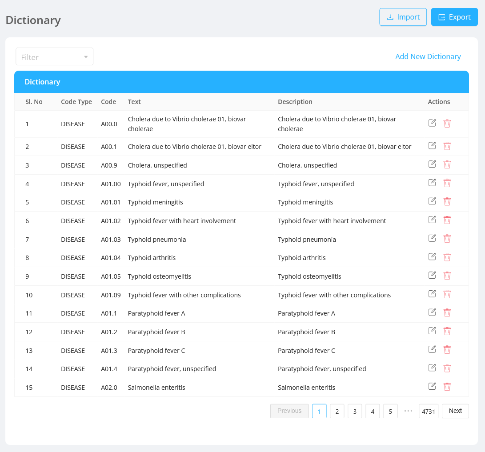
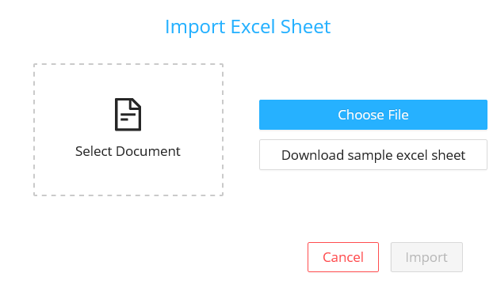
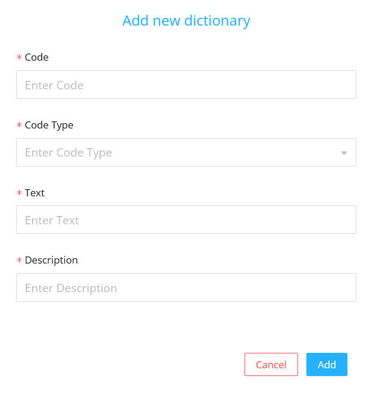
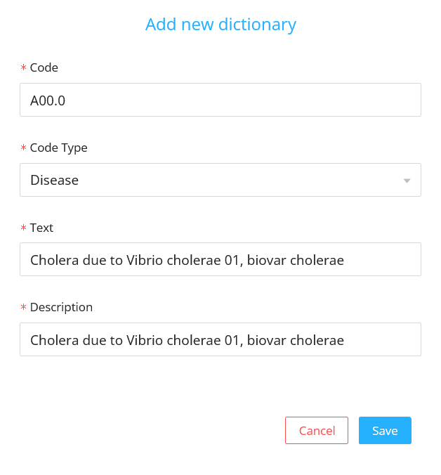
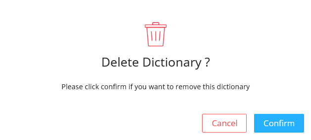
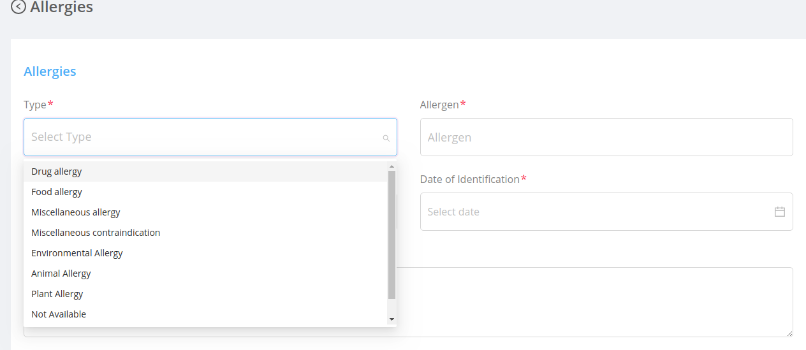

Dictionaries are the application meta datas which are used as the dropdowns throughout the application like `disease` , `allergy` , `citizenship` , `email type` , `generic codes` , `citizenship` , `primary languages` , `specialities`, etc.

## Import

- On clicking the `Import` button, the import modal will be opened.
  
- If the user wants to import a new dictionary list:
  - The admin can download the sample excel sheet by clicking the `Download sample excel sheet` button.
  - Then prepare the new dictionary list similar to the sample excel sheet .
- Select the downloaded file from the device and click on `Import` button in the modal.

## Export

- The default dictionary list can be exported by clicking on the `Export` button on the top.
- Downloaded file can be [imported](#import) to get a default dictionary list.

## Create New Dictionary

User can create a new dictionary by clicking the `Add New Dictionary` button.

#### Fields

- `Code` : It is the code of the meta datas i.e., the values which comes in the dropdowns in various screens.
- `Code Type` : It is the type of application meta data.
- `Text` : It is the text of the dictionary.
- `Description` : It is the description of the dictionary.

## Filtering

Dictionaries can be filtered based on the different dictionary types like `disease` , `allergy`, `citizenship` , `email type` , `generic codes` , `citizenship` , `primary languages` , `specialities` etc

## Listing

Dictionary section displays the list of dictionaries with each dictionary having information about [fields](#fields).

- #### Edit:

  - On clicking the edit icon, the edit modal will be opened.
  - The admin can either edit the dictionary details and save it .
  - The edit modal contains the same [fields](#fields) displayed in the table.
    

- #### Delete:

  It deletes the dictionary permanently.

  - On Clicking the delete icon, a confirmation modal will be displayed before deleting the dictionary permanently.
  - After confirming the delete action the deleted dictionary will no longer be displayed in the dictionary listing table.

  

## UI Changes

The added dictionary will be used as the values for different dropdown. For example,

1. Login as doctor.
2. In the side bar click the Allergies section.
3. Inside the Allergies section, the `Type` field dropdown values are the added dictionaries of the code type `Allergy`.

