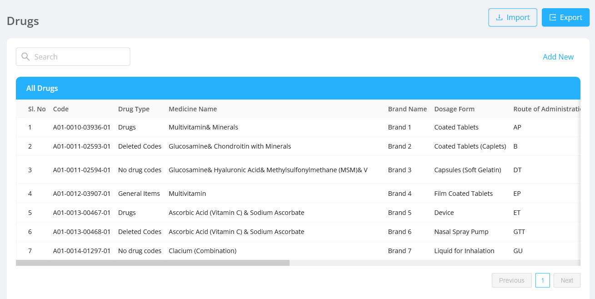
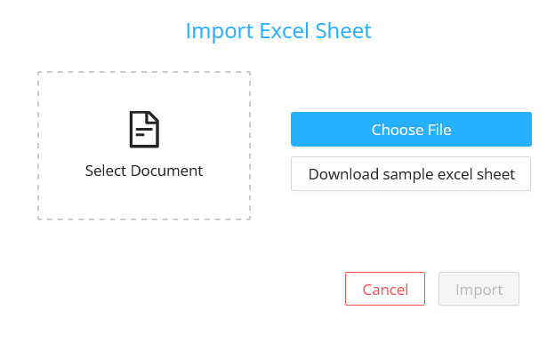
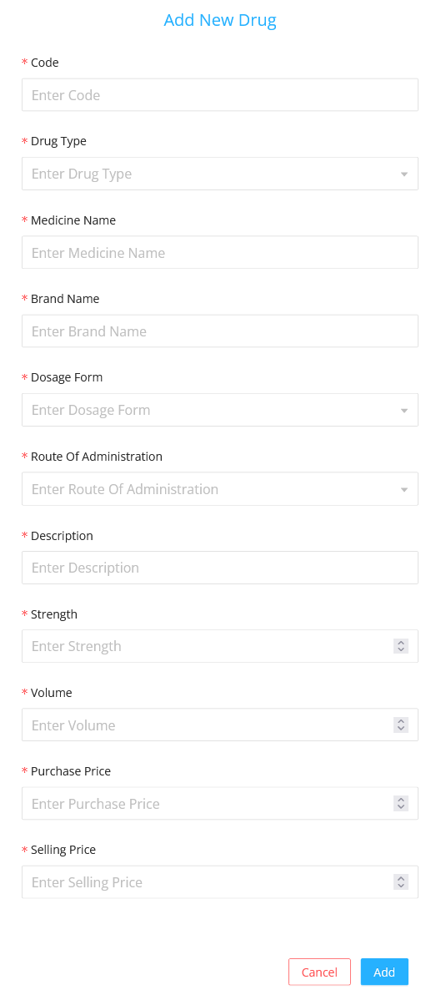
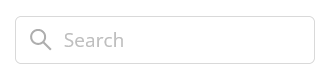
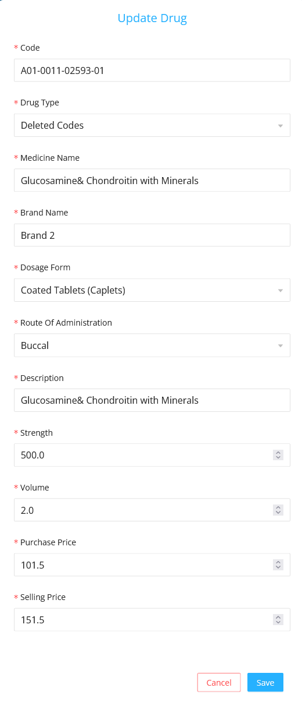
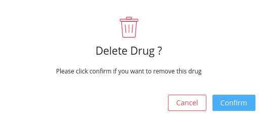
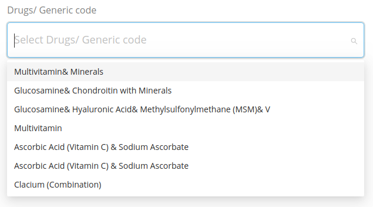
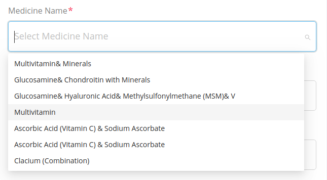

Drugs section allows the admin to upload the drugs which is prescribed by the doctor after examining the patient.

## Import

- On clicking the `Import` button, the import modal will be opened.

- If the user wants to import a new drugs list:
  - The admin can download the sample excel sheet by clicking the `Download sample excel sheet` button.
  - Then prepare the new drugs list similar to the sample excel sheet .
- Select the downloaded file from the device and click on `Import` button in the modal.

## Export

- The default drugs list can be exported by clicking on the `Export` button.
- Downloaded file can be [imported](#import) to get a default drugs list.

## Create New Drug

User can create a new drugs by adding the drug details in the modal displayed after clicking the `Add New` button.

#### Fields

- `Code` : It is the code of the meta datas i.e., the values which comes in the dropdowns in various screens.
- `Drug Type` : It is the type of application meta data.
- `Medicine Name` : It is the name of the medicine.
- `Brand Name` : It is the name of the medicine brand.
- `Dosage Form` : It is the form in which the drug is available to the patients like `Coated Tablets`, `Capsules`, etc.
- `Route Of Administration` : It is the method of how the drug is to be administered.
- `Descriptions` : It is the drug description.
- `Strength` : It is the strength of the drug in numerical value.
- `Volume` : It is the volume of the drug in numerical value.
- `Purchase Price` : It is the price in which the drug was purchased.
- `Selling Price` : It is the price in which the drug will be sold.

## Searching

Drugs can be searched based on the drug code.

## Listing

Drugs section displays the list of drugs with each drug having information about [fields](#fields).
- #### Edit:

  - On clicking the edit icon, the edit modal will be opened.
  - The admin can either edit the drug details and save it .
  - The edit modal contains the same [fields](#fields) displayed in the table.

- #### Delete:

  It deletes the drug permanently.

  - On Clicking the delete icon a confirmation modal will be displayed before deleting the drug permanently.
  - After confirming the delete action the deleted drug will no longer be displayed in the drug listing table.

## UI Change

The changes made in drugs will get reflected in the Medical history section of the doctor screen:

The changes made in drugs gets reflected in the in Prescriptions section of the doctor screen:

