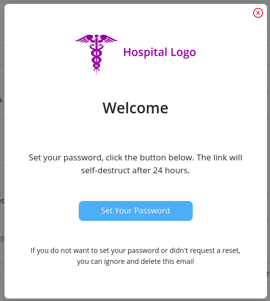
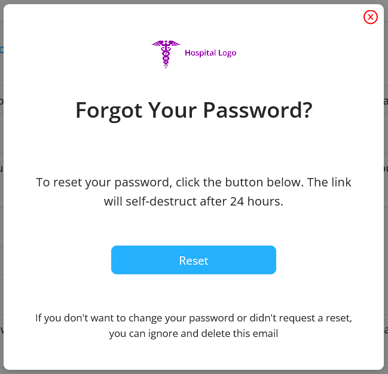

Email Template section is to send email preview to the users.

This section consists of 2 email templates:

### New User Template

  This email is send to the patient user when the receptionist registers that particular patient.

  ##### Fields

  - `Subject` : It is the subject of the email send to user.
  - `Header` : It is the header of the email template.
  - `Message` : It is the message which is shown under the header section in the email preview.
  - `Button Name` : It is the content to be displayed on the button.
  - `Footer` : It is the footer portion of the email template.

  Preview option is available for displaying sample preview of the New User Template.

  

  The email template send to the user is :

  

### Reset Password Template

  This reset password is send to user when the receptionist request for resetting the password.
  It contains the same [fields](#fields) as of the New User Template .

  Preview option is available for displaying sample preview of the Reset Password Template.

  

  The email template send to the user is :

  

### Status Email Template

  This status email is send to the patient user when there is any change in the appointment status i.e., when the appointment is booked, confirmed, rescheduled or cancelled.
  It contains the same [fields](#fields) as of the New User Template .

  Preview option is available for displaying sample preview of the Status Email Template.

  

  The email template send to the user is :

  