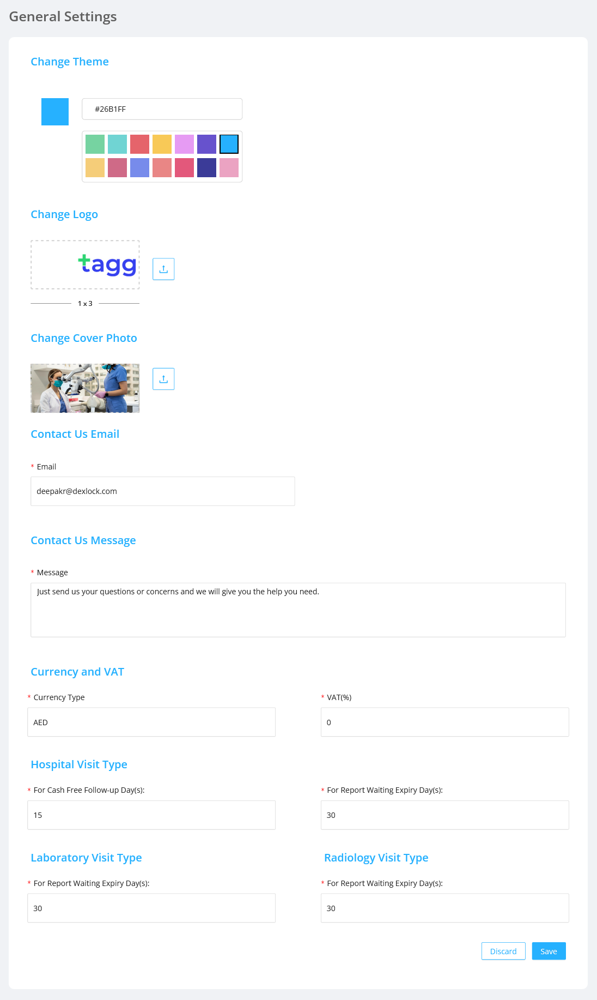

This option gives admin the provision to: 
- Change the logo, theme, cover photo
- Set the email to which the user can contact along with a message
- Configure currency and VAT
- Cash free follow-up days, report waiting expiry days according to the respective visit types

### Theme

- A 14 colour palette is provided to the admin.
- The admin can choose which colour has to be set as the theme colour of the application from the palette.

### Logo

- The admin has the option to upload logo of the origanization for which the application is used.
- This logo will be set as the default logo.
- The logo set by the admin user will be displayed throughout the application.
- The logo size must be in the ratio 1:3.

### Cover Photo

- This allows the admin to set the cover picture which is to be displayed in the login page of the application.

### Contact Email

- This allows the admin to set the email to which users can send mail inorder to communicate with the organization.

### Contact Messages

- This allows the admin to set a message in the contact section.

### Currency and VAT

- This allows the admin to set the currency and VAT.

### Visit Types

This allows the admin to set:

- cash free follow-up day(s) in the hospital visit type section
- report waiting expiry day(s) in the hospital, laboratory, radiology visit type section

## UI Changes

- Changed UI screen with updated cover photo, contact us message,theme and logo

