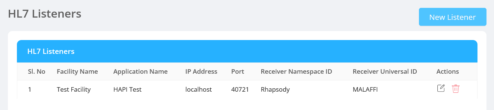
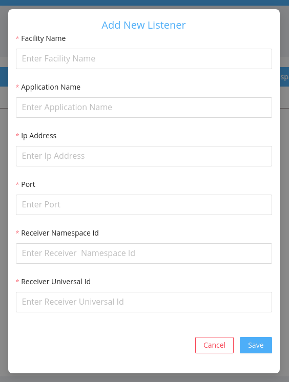
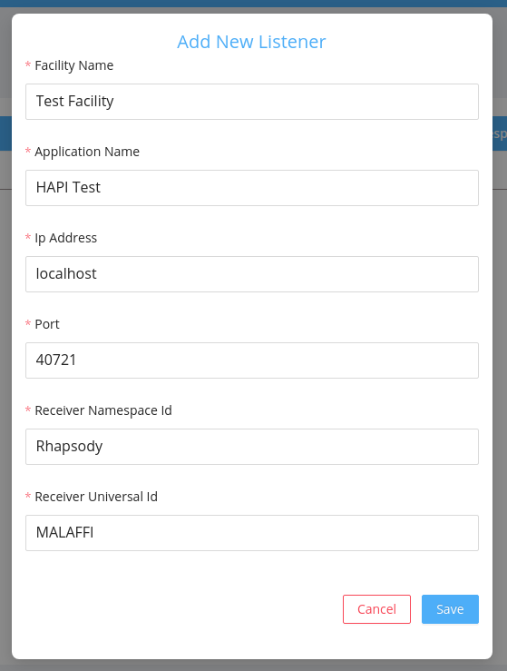
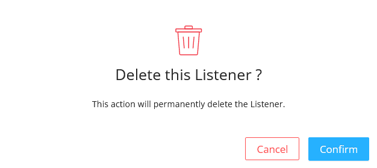

HL7 Listeners screen helps to configure the listeners who will receive the HL7 messages by specifying the needed [parameters](#fields).

## HL7 Listener

The HL7 Listener is a utility which functions like a simple HL7 server. It is designed to make it easy to listen and record a stream of messages from an HL7 server.

Listeners details include the following fields:

- `Facility Name` : It is the name of the facility.
- `Application Name` : It is the name of the application.
- `Ip Address` : It is the IP address of the application.
- `Port` : It is the port of the application.
- `Receiver Namespace Id` : It is the namespace Id of the receiver.
- `Receiver Universal Id` : It is universal Id of the receiver.
- `Actions`: It includes two actions:

  - ##### Edit

    It allows the admin to edit the listener details.The admin can edit the following fields of the HL7 Listener:

    - `Facility Name` , `Application Name` , `Ip Address` , `Port` , `Receiver Namespace Id` , `Receiver Universal Id`.

    

  - ##### Delete

    It deletes the listener permanently.

    - On Clicking the delete icon, a confirmation modal will be displayed before deleting the listener permanently.
    - After confirming the delete action, the deleted listener will no longer be displayed in the HL7 Listeners listing table.

      
