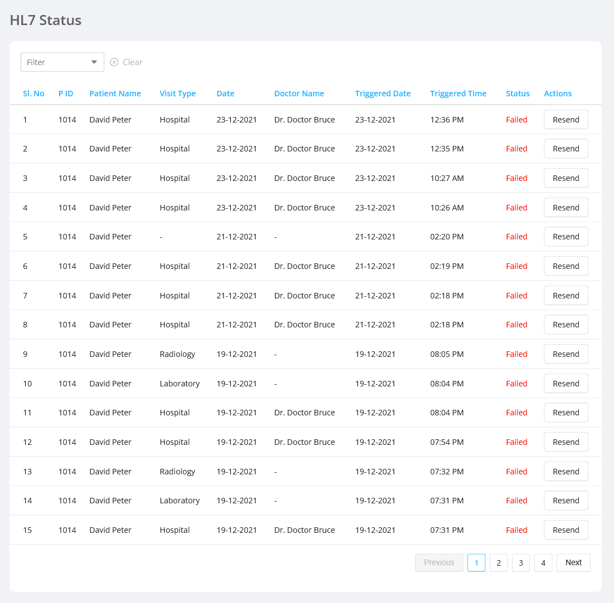

HL7 status section displays the list of trigerred HL7 messages alongwith its statuses. There is also a provision to Resend the failed HL7 messages.

HL7 status listing details include:

- `P ID` : It is the id of the patient
- `Patient Name` : It is the name of the patient
- `Visit Type` : It is the visit type of the triggered appointment
- `Date` : It is the date of appointment
- `Doctor Name` : It is the name of doctor assigned
- `Triggered Date` : It is the date of HL7 message trigger
- `Triggered Time` : It is the time of HL7 message trigger
- `Status` : It is the status of the trigerred HL7 message
- `Actions` : It includes the resend action

  - ##### Resend

    It allows the admin to Resend the failed HL7 messages

    
