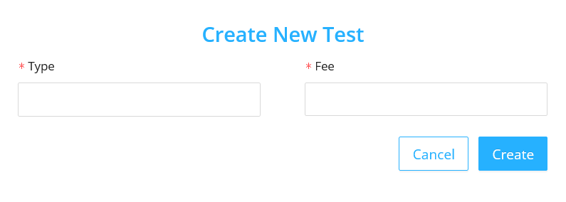
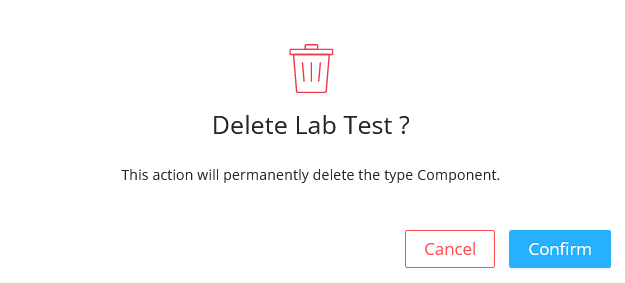

The Laboratory section deals with the lab tests available for the patient.

## Listing the Specimens

- This section lists the specimens which the patient needs to be tested.

- The table contains:

  - `Types` : It is the name of the specimen.
  - `Actions` : It includes generally three main functions :

    - #### Manage Test Type
      - It includes the list of chemical components of the specimen which needs to be tested.
    - #### Edit

      - On clicking the edit icon, the edit modal will be opened.
      - The admin can edit the specimen name in the `Type` field and save it.
      

    - #### Delete
      - On Clicking the delete icon, a confirmation modal will be displayed before deleting the specimen permanently.
      - After confirming the delete action, the deleted specimen will no longer be available for testing.
      
  
## Create New Specimen

- Click on the `New Type` button.
- In the modal, add the name of the new specimen in the `Type` field.
- Click on the `Create` button to add the new specimen.

## Listing the Chemical Components

- This section lists the chemical components of the specimen which needs to be tested.

- The table contains:

  - `Types` : It is the name of the chemical component of the selected specimen.
  - `Actions` : It includes generally three main functions :

    - #### Manage Tests
      - It includes the list of chemical components of the specimen which needs to be tested.
    - #### Edit

      - On clicking the edit icon, the edit modal will be opened.
      - The admin can edit the chemical component name in the `Type` field and save it .
      

    - #### Delete
      - On clicking the delete icon, a confirmation modal will be displayed before deleting the chemical component of the specimen permanently.
      - After confirming the delete action, the deleted chemical component of the specimen will no longer be available for testing.
      
  
## Create New Chemical Component for the Specimen

- Click on the `Create New Test Type` button
- In the modal, add the name of the new chemical component of the specimen in the `Type` field.
- Click on the `Create` button to add the new specimen.

## Listing the Tests

- This section displays the list of currently available tests.

- The table contains:

  - `Tests` : It is the name of the chemical components of the selected specimen.
  - `Fee` : It is the fee for that particular test.
  - `Actions` : It includes generally three main functions :

    - #### Manage Fields

      - It includes the list of fields that can be configured for that particular test.

    - #### Edit

      - On clicking the edit icon, the edit modal will be opened.
      - The admin can edit the test name in the `Type` field, edit its fee in the `Fee` field and save it.
    
      

    - #### Delete
      - On clicking the delete icon, a confirmation modal will be displayed before deleting the test permanently.
      - After confirming the delete action the test will no longer be available.
      

## Create New Test

- Click on the `Create New Test` button
- In the modal, add the name of the new chemical component of the specimen in the `Type` field and its corresponding fee in the `Fee` field.
- Click on the `Create` button to add the new specimen.

## Listing the Lab Test Fields

- This section displays the list of currently available lab test fields.

- The table contains:

  - `Fields` : It is the name of lab test fields of the selected lab test.
  - `Type` : It is the type of the field like `Input Text` , `Input Number` , `Dropdown` , `Radio Button` , `Text Area`.
  - `Mandatory Field` : It is a checkbox to record whether the field is mandatory or not.
  - `Input Box` : It allows the user to choose the size of the input box from the options.
    - `Full Width` : On selecting full width, the field occupies the full width of the form container.
    - `Half width` : On selecting half width, the field occupies the half width of the form container.
  - `Actions` : It includes generally two main functions:

    - #### Edit

      - On clicking the edit icon, the edit modal will be opened.
      - The admin can edit the above mentioned [fields](#listing-the-lab-test-fields) and save it.
      

    - #### Delete
      - On clicking the delete icon, a confirmation modal will be displayed before deleting the test field permanently.
      - After confirming the delete action the test field will no longer be available.
      

## Create New Test Fields

- Click on the `Create New Field` button
- In the modal, add values for the above mentioned [fields](#listing-the-lab-test-fields).
- Click on the `Create` button to add the new test field.

#### Preview of the fields

- On clicking the `Preview` button in the `Laboratory` <- `Laboratory Test Type` <- `Lab Test` <- `Fields` page, the preview modal will be diplayed.
- The modal contains the all the configured fields of the selected test.

#### Change the field order

- Click on the `Change Order` button.
- Change the order as per the requirement by dragging.
- Click on `Save Order`.

## UI Change

- #### Doctor User UI:
  Steps to be followed in the Doctor screen are:

  - Select Specimen from the `Type` field.
  - Then select the Chemical Component from the `Test` field.

  The Doctor user screen is as follows:

  

- #### Laboratory User UI:

  The Laboratory user screen is as follows:

  