This option gives the admin to add a new insurance scheme as well as update and delete an existing insurance scheme.

## Listing

This section lists the added insurance providers.

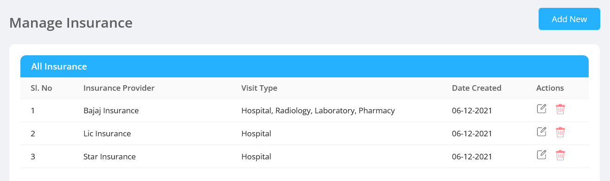

## Create Insurance

- Admin can add a new insurance provider.

  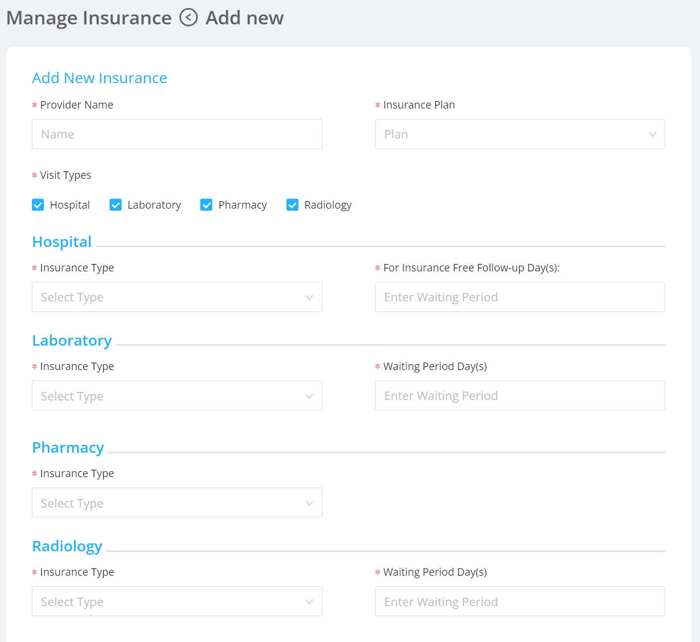
- It contains the following fields:

  - `Provider Name` : Name of the company providing the insurance.
  - `Insurance Plan` : List of plans available for that particular insurance provider.
  - `Insurance Type` : Type of the insurance being taken.

    - There are 3 Insurance Types: `Self` , `Copay` , `Both`.

    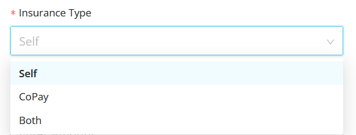

  - `Amount` : The bill amount of the patient to which the insurance is covered.
  - `Type` : There are 2 options of representing the amount - `Percentage` , `Fixed Amount`.

      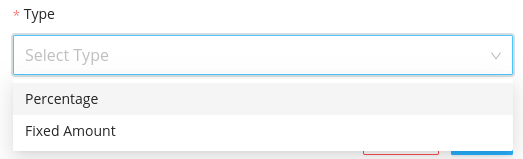

- Once the insurance is created, it will be visible in the Appointment Booking screen of the reception/patient like:

  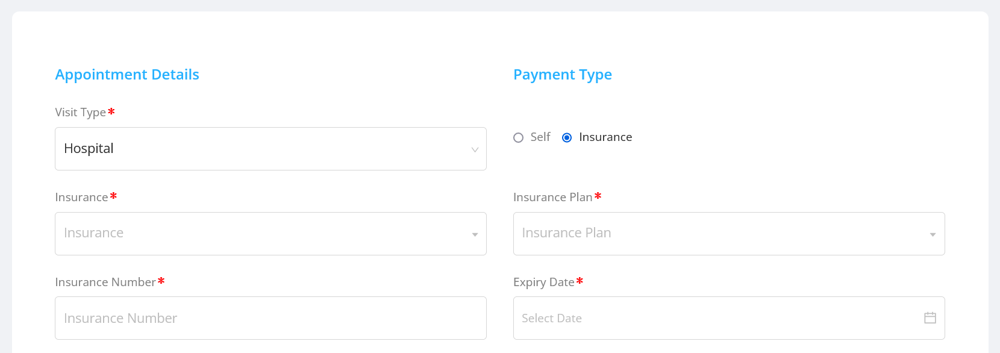

## Edit Existing Insurance

- Admin can edit/update an already existing insurance scheme details.
- All fields which was mentioned earlier can be updated by the admin.
- Edit option can be found in the right side of all available insurance policies in the admin page.

  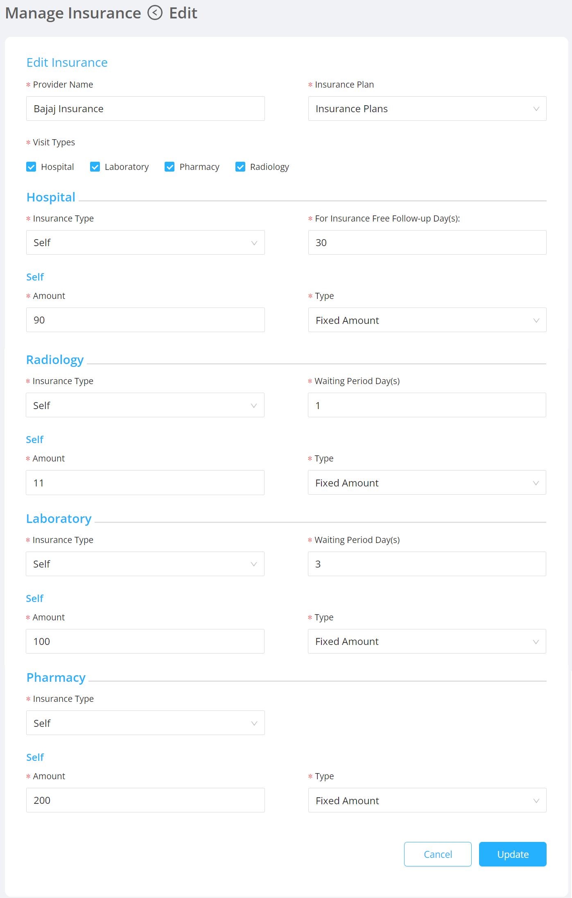

## Delete Existing Insurance

  - Admin can delete an already existing insurance scheme.

  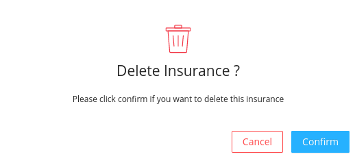

## Insurance User UI

  - For Laboratory and Radiology visits with payment type as insurance, 
    - The Insurance user can approve/decline the orders listed in the Waiting for Pre-Approval tab in dashboard. 
    - Then the Receptionist can book visit for the accepted/declined orders. In case of declined orders, the amount has to be collected in cash.      
    - Once the Laboratory/Radiology reports are uploaded and submitted, the orders will be listed in the Pending Claim tab of the Insurance user's dashboard where the insurance user can submit and approve/decline the claim.

    Waiting for Pre-Approval - Laboratory Visit: 

    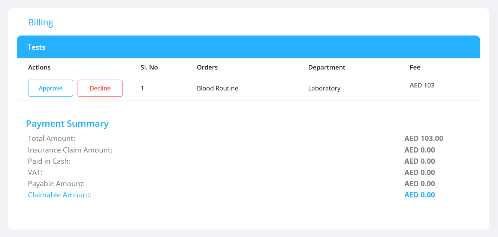

    Pending Claim - Laboratory Visit:

    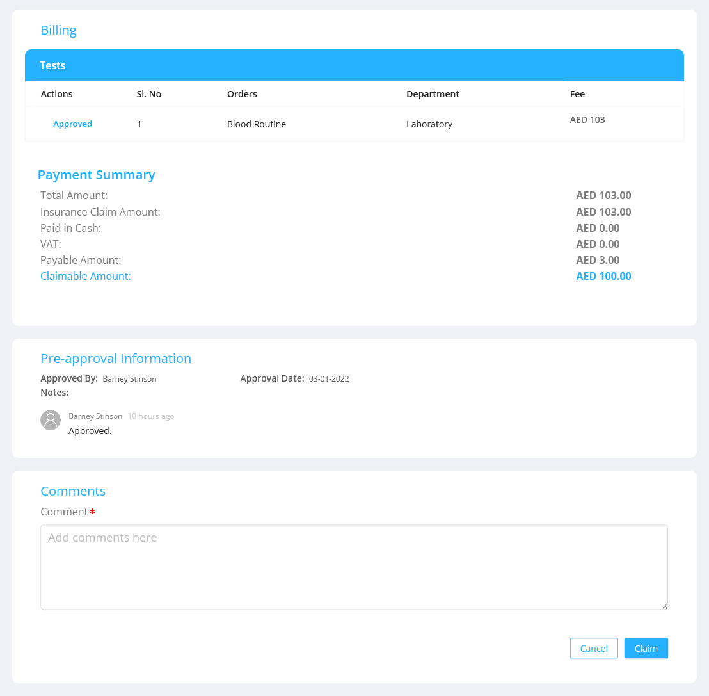

    Waiting for Pre-Approval - Radiology Visit:

    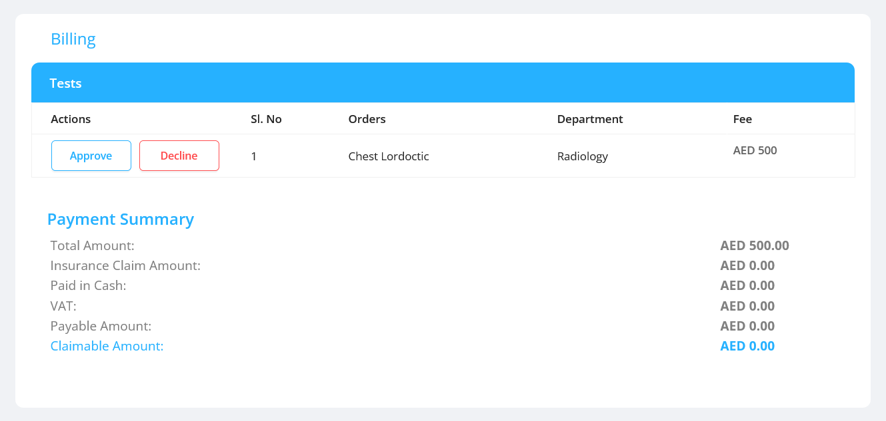

    Pending Claim - Radiology Visit:

    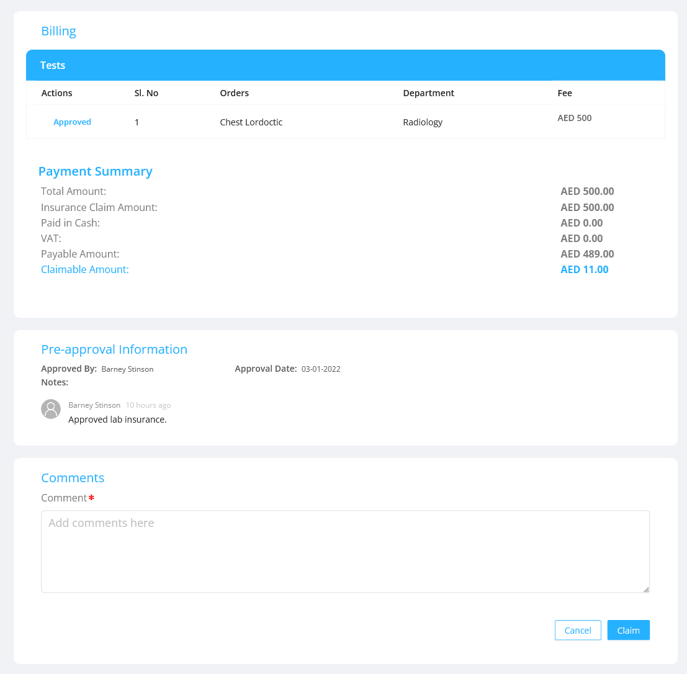

  - For Hospital and Pharmacy visits with payment type as insurance, the appointment has to be completed for it to be listed in the Pending Claim tab of the Insurance user's dashboard where the insurance user can submit and approve/decline the claim.  

  Pending Claim - Hospital Visit:

  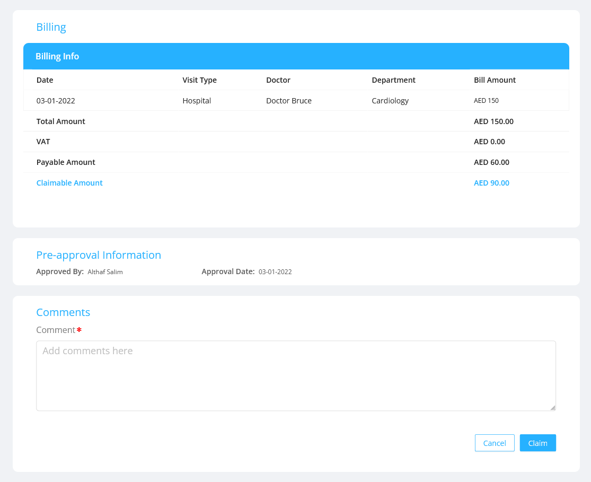

  Pending Claim - Pharmacy Visit:

  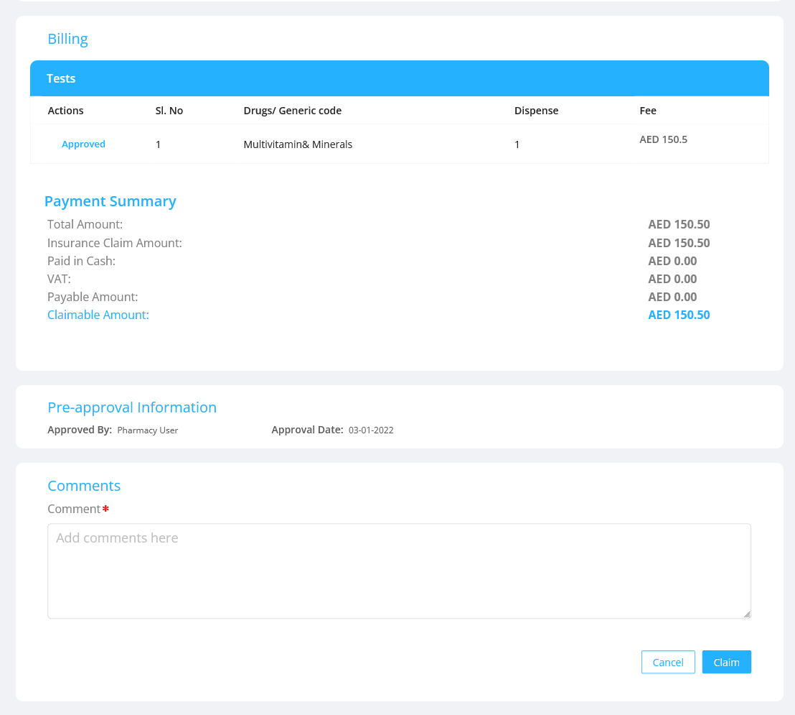