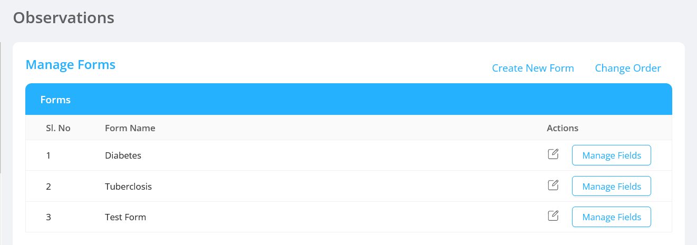
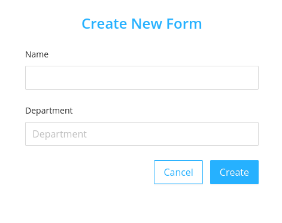
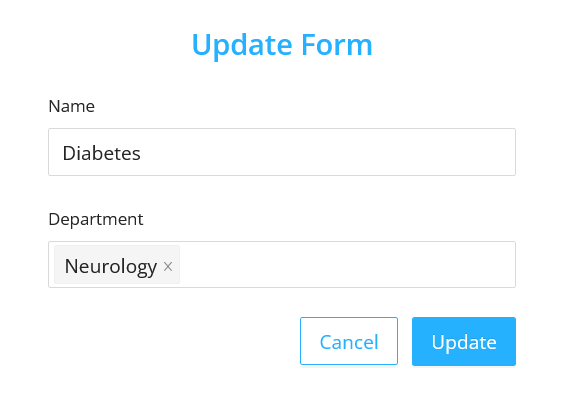
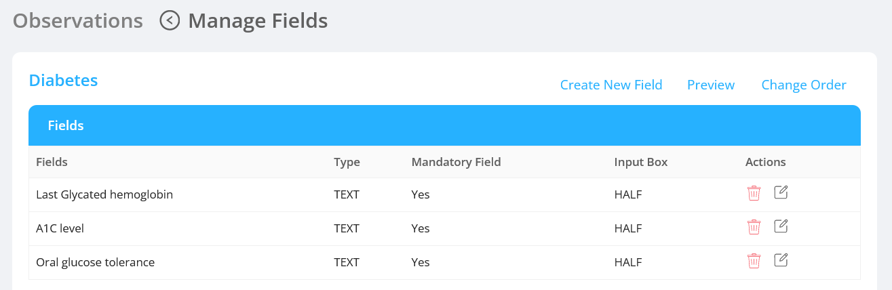
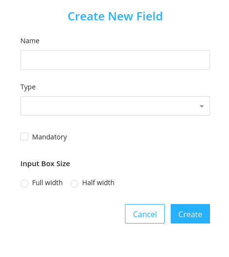
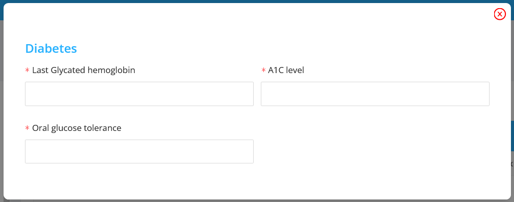
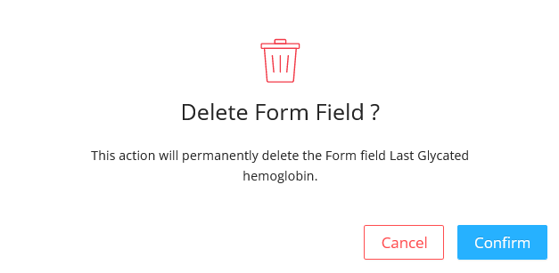
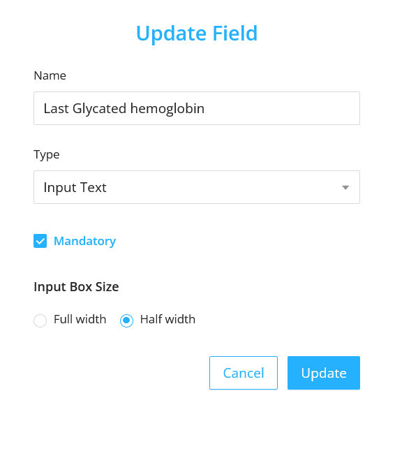
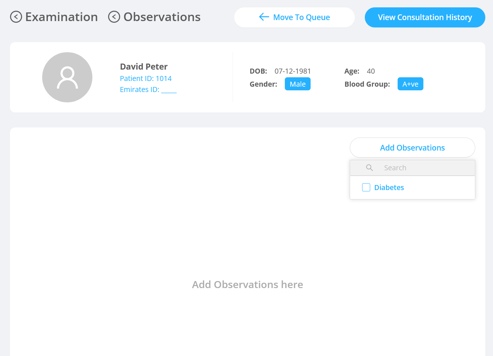

The observation screen allows the admin to configure the observation form used by the doctor to record the health details after examining the patient.

## Listing Observation Forms

This screen lists different observation items called forms. Each form item has different fields.

## Create Observation Form

- Click on the `Create New Form` button.
- It opens a modal having fields:
  - `Name`: It is an input text field to enter the form name.
  - `Department`: It is a dropdown with department names as the values.
- Each form has different fields which can be created by clicking on `Manage fields` and then further clicking the [Create New Field](#create-observation-fields)

## Edit Observation Form

- On clicking the edit icon the edit modal will be opened.
- The edit modal contains the fields:
  - `Name`: It is an input text field to enter the form name.
  - `Department`: It is a dropdown with department names as the values.

## Observation Form Fields

- On clicking the `Manage Fields` , the fields configured in that particular form will be displayed.

## Create Observation Fields

- On Clicking the `Create New Field` in the `Observations` <- `Manage Fields` page opens a modal to create the observation fields.
- The modal contains fields:

  - `Name` : It is the name used to identify the field.
  - `Type` : It is the type of the field like drop down, text area, input text, radio button, date picker, input number.
  - `Mandatory` : It is a checkbox to record whether the field is mandatory or not.
  - `Input Box Size` : It allows the user to choose the size of the input box from the options.

    - `Full Width` : On selecting the full width the field occupies the full width of the form container.
    - `Half width` : On selecting the half width the field occupies the half width of the form container.

    

#### Preview of the fields

- On clicking the `Preview` button in the `Observations` <- `Manage Fields` page, the preview modal will be diplayed.
- The modal contains the all the configured fields of the selected observation section.

#### Change the field order

- Click on the `Change Order` button
- Change the order as per the requirement by dragging
- Click on `Save Order`

## Delete Observation Fields

It deletes the field permanently.

- On Clicking the delete icon a confirmation modal will be displayed before deleting the field permanently.
- After confirming the delete action the deleted field will no longer be displayed in the `Manage Fields` subsection of the respective observation form.

## Edit Observation Fields

- On clicking the edit icon the edit modal will be opened.

  - The admin can edit the observation field.
  - The edit modal contains the same [fields](#create-observation-fields) as of the Create Observation Fields.

## UI Change

The added observation gets reflected in the respective doctor's observation screen:

