The Radiology section deals with the radiology tests available for the patient.

## Listing the Human Body Parts

- This section lists the human body parts which is scanned to identify and monitor certain diseases.

- The table contains:

  - `Sections` : It is the name of the human body part.
  - `Actions` : It includes generally three main functions :

    - #### Manage Test Type
      - It includes the list of different types of imaging technologies available for a particular human body part.
    - #### Edit

      - On clicking the edit icon, the edit modal will be opened.
      - The admin can edit the name of the body part in the `Type` field and save it .
      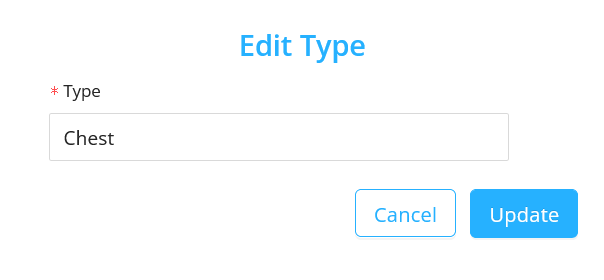

    - #### Delete
      - On clicking the delete icon, a confirmation modal will be displayed before deleting the body part permanently.
      - After confirming the delete action, scanning tests will not be available for the deleted body part.
      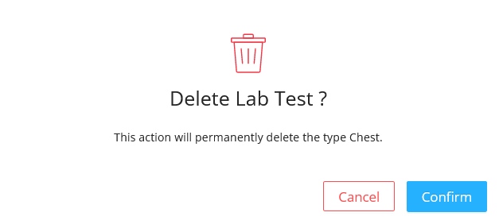

## Create New Human Body Part

- Click on the `New Type` button
- In the modal, add the name of the human body part in the `Type` field.
- Click on the `Create` button to add the new human body part.

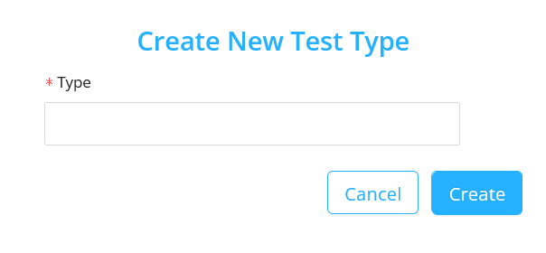

## Listing the Imaging Technologies

- This section lists the different type of imaging technologies available for the selected human body part.

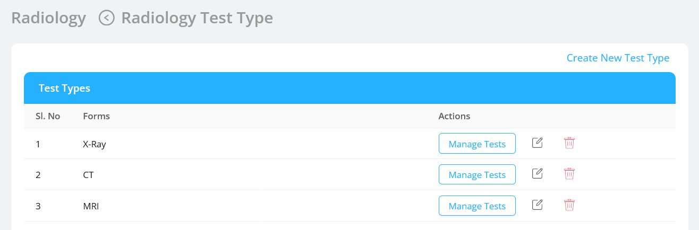

- The table contains:

  - `Forms` : It is the name of the Imaging Technologies.
  - `Actions` : It includes generally three main functions :

    - #### Manage Tests
      - It includes the list of the different types of imaging technologies.

    - #### Edit

      - On clicking the edit icon the edit modal will be opened.
      - The admin can edit the imaging technology name in the `Type` field and save it .

      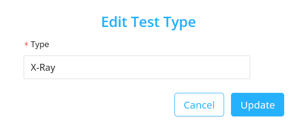

    - #### Delete
      - On clicking the delete icon, a confirmation modal will be displayed before deleting the imaging technology permanently.
      - After confirming the delete action, the deleted imaging technology will no longer be available.

      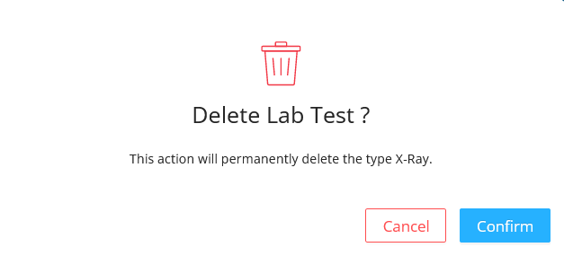

## Create New Imaging Technology

- Click on the `Create New Test Type` button
- In the modal, add the name of the new imaging technology in the `Type` field.
- Click on the `Create` button to add the new imaging technology.

## Listing the Imaging Tests

- This section displays the list of imaging tests.

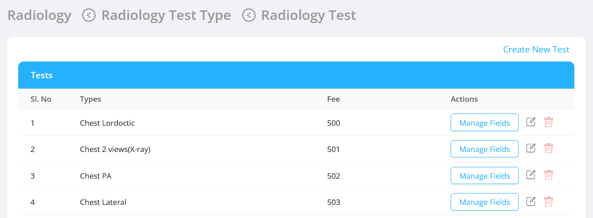

- The table contains:

  - `Types`: It is the name of the imaging test of the selected Imaging Technology.
  - `Fee` : It is the fee for that particular imaging test.
  - `Actions`: It includes generally three main functions:

    - #### Manage Fields

      - It includes the list of fields that can be configured for that particular imaging test.  

    - #### Edit

      - On clicking the edit icon, the edit modal will be opened.
      - The admin can edit the test name in the `Type` field, edit its fee in the `Fee` field and save it.

    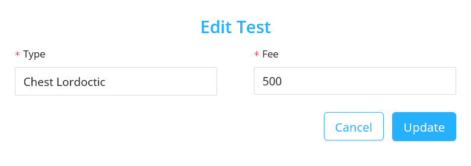

    - #### Delete
      - On clicking the delete icon, a confirmation modal will be displayed before deleting the imaging test permanently.
      - After confirming the delete action, the imaging test will no longer be available.

    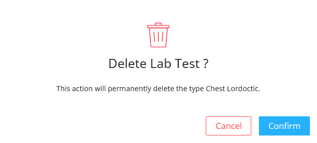

## Create New Imaging Test

- Click on the `Create New Test` button.
- In the modal, add the name of the new imaging test in the `Type` field and its corresponding fee in the `Fee` field.
- Click on the `Create` button to add the new imaging test.

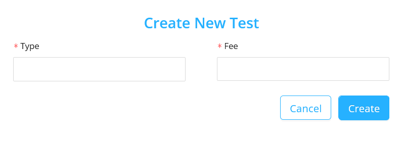

## Listing the Radiology Test Fields

- This section displays the list of currently available radiology test fields.

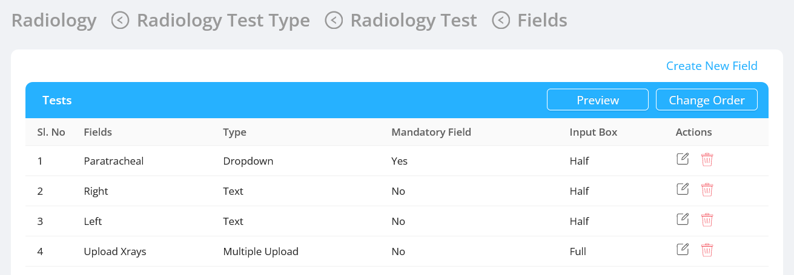

- The table contains:

  - `Fields` : It is the name of lab test fields of the selected radiology test.
  - `Type` : It is the type of the field like `Input Text` , `Input Number` , `Dropdown` , `Radio Button` , `Text Area`.
  - `Mandatory Field` : It is a checkbox to record whether the field is mandatory or not.
  - `Input Box` : It allows the user to choose the size of the input box from the options.
    - `Full Width` : On selecting full width, the field occupies the full width of the form container.
    - `Half width` : On selecting half width, the field occupies the half width of the form container.
  - `Actions` : It includes generally two main functions:

    - #### Edit

      - On clicking the edit icon, the edit modal will be opened.
      - The admin can edit the above mentioned [fields](#listing-the-radiology-test-fields) and save it.
      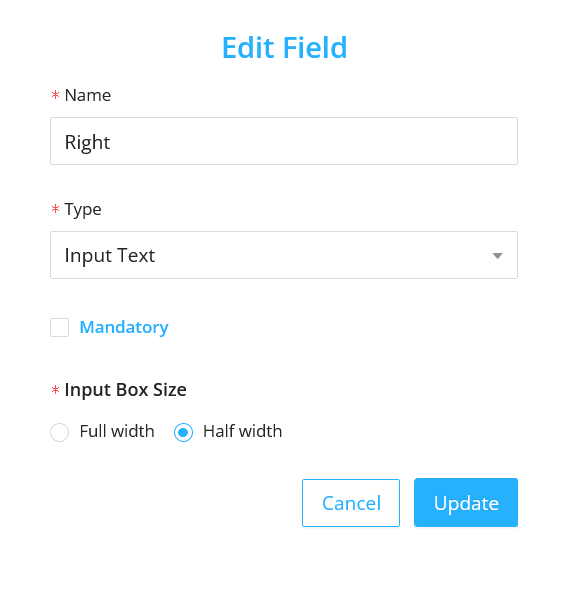

    - #### Delete
      - On clicking the delete icon, a confirmation modal will be displayed before deleting the test field permanently.
      - After confirming the delete action the test field will no longer be available.
      

## Create New Test Fields

- Click on the `Create New Field` button
- In the modal, add values for the above mentioned [fields](#listing-the-radiology-test-fields).
- Click on the `Create` button to add the new field.

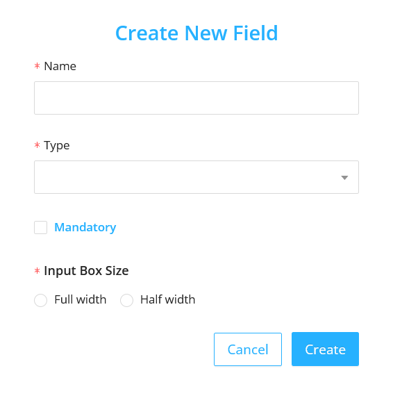

#### Preview of the fields

- On clicking the `Preview` button in the `Radiology` <- `Radiology Test Type` <- `Radiology Test` <- `Fields` page, the preview modal will be diplayed.
- The modal contains the all the configured fields of the selected radiology test.

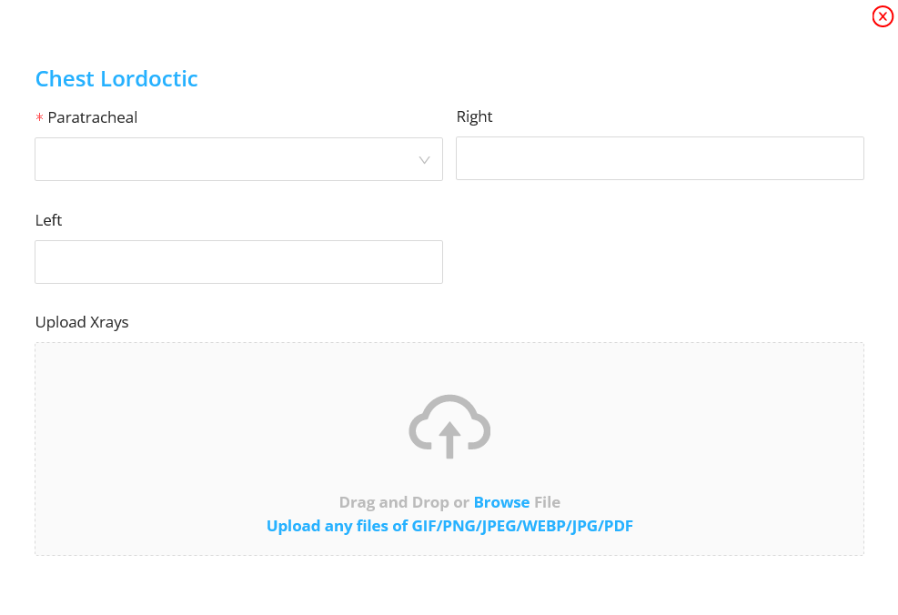

#### Change the field order

- Click on the `Change Order` button.
- Change the order as per the requirement by dragging.
- Click on `Save Order`.

## UI Changes

- #### Doctor User UI:
  Steps to be followed in the Doctor screen are:

  - Select the human body part from the `Type` field.
  - Then select the radiology test from the `Test` field.

  The Doctor user screen is as follows:

  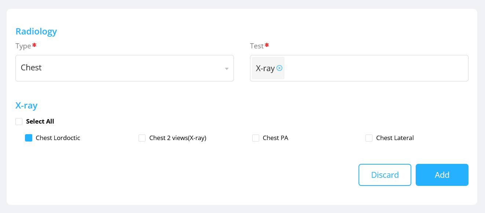

- #### Radiology User UI:

  The Radiology user screen is as follows:

  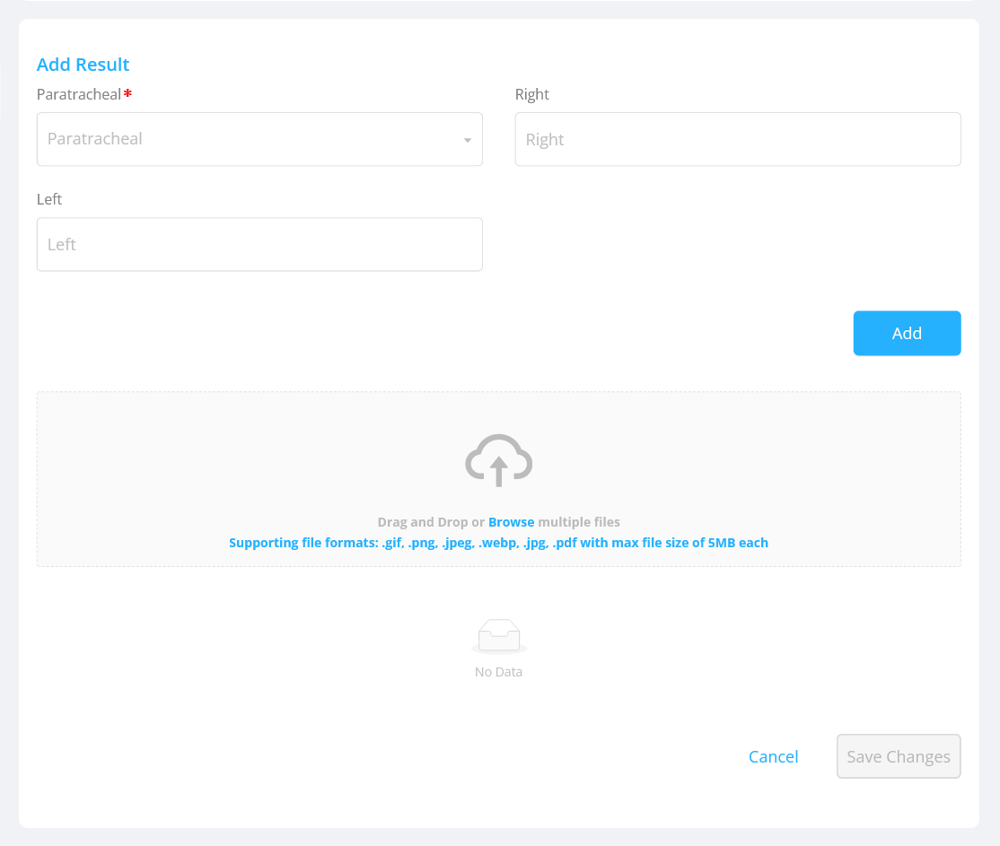