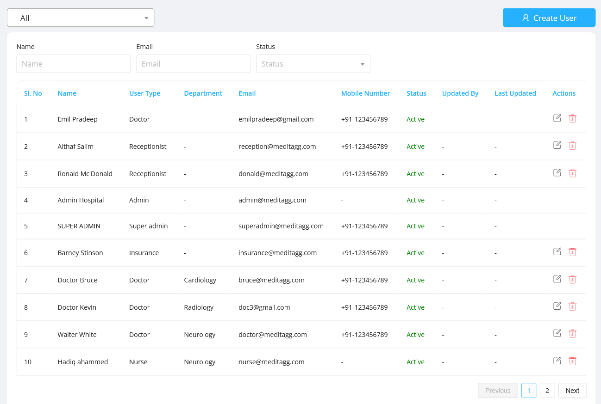
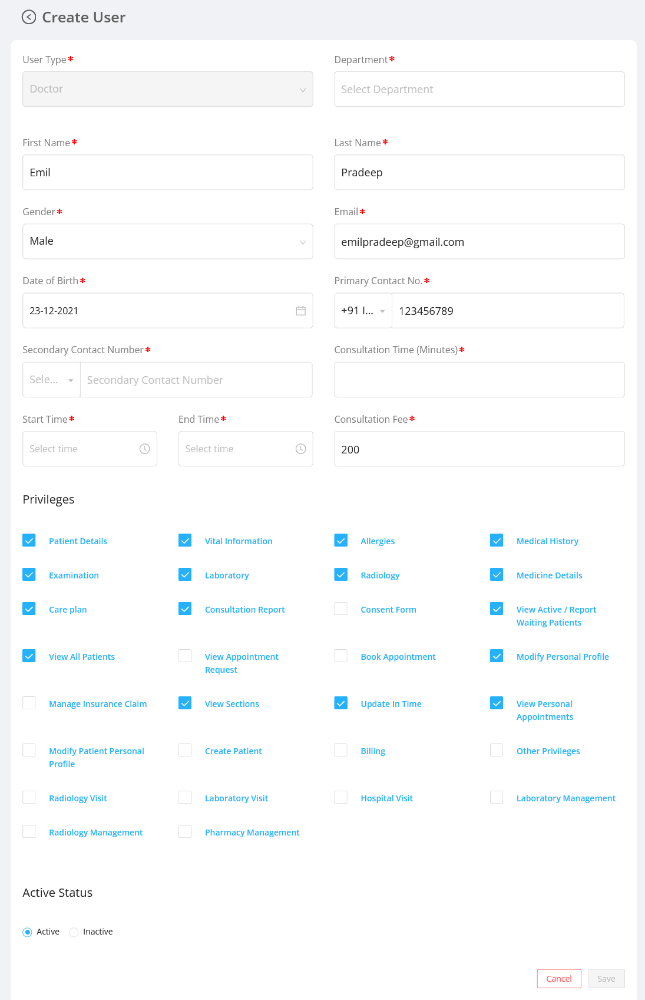
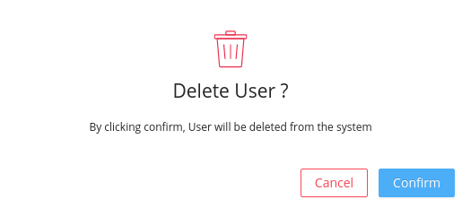
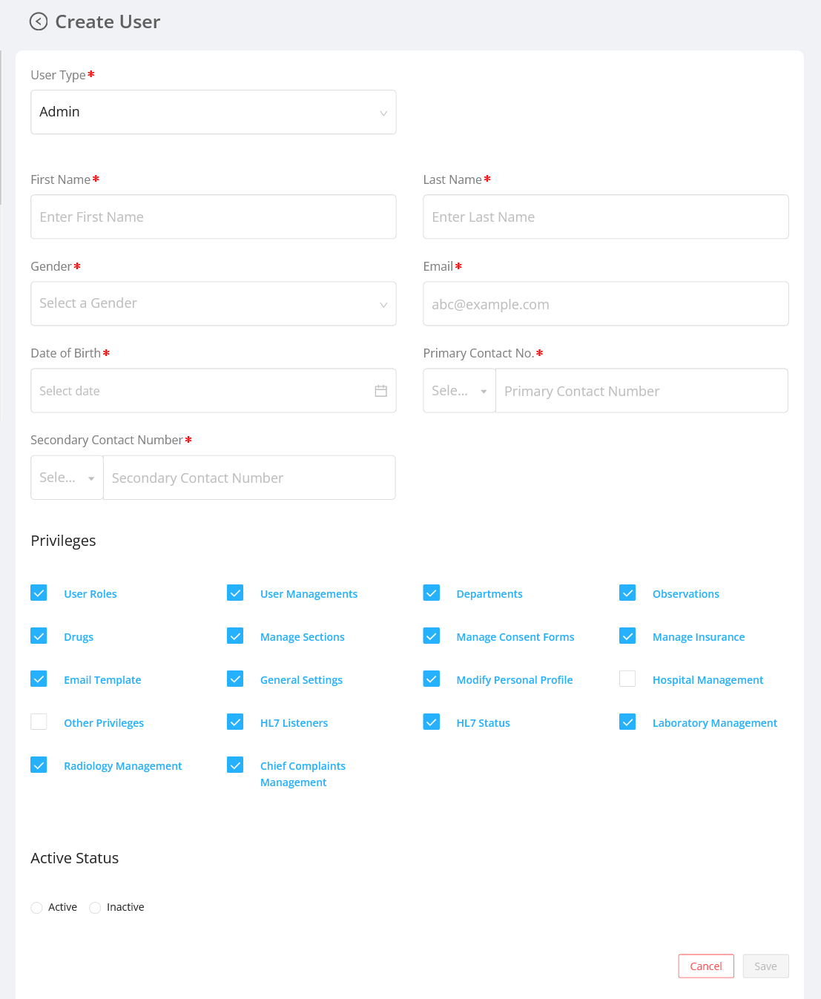

## Listing the Users

User Management section displays the list of users in a table and these users can be filtered based on `User role` , `Name` , `Status` , `Email`.

## User Details

User details include:

- `Name` : It is the name of the user.
- `User Type` : It is the role of the user.
- `Department` : It denotes the department to which the user belongs.
- `Email` : It is the registered email of the user.
- `Mobile Number` : It is the phone number of the user.
- `Status` : It is to indicate whether the user is active or not.
- `Updated By` : It is the name of the user who updated the user details recently.
- `Last Updated` : It is the date when the user details are recently updated.
- `Actions` : It includes two actions:

  - ##### Edit :

    It allows the admin to edit the user details. The admin can edit the following fields of the user:

    - `User Type` , `Department` , `First Name` , `Last Name` , `Gender` , `Date of Birth` , `Primary Contact No` , `Secondary Contact Number` , `Consultation Time (Minutes)` , `Start Time` , `End Time` , `Consultation Fee` , `Privileges` , `Active Status`

    - While editing a selected user, the admin can assign a special user permission by selecting the particular permission under the privileges section.

    

  - ##### Delete
    It deletes a user permanently.
    - On clicking the delete icon, a confirmation modal will be displayed before deleting the user permanently.
    - After confirming the delete action the status of the deleted user will be shown as `Deleted` in the user listing table.

## Create New User

New user can be added by clicking the `Create User` button.

Create User modal have same [fields](#fields) as in edit modal.

- On creating a new user the admin can assign a special user permission by selecting the particular permission under the privileges section.

