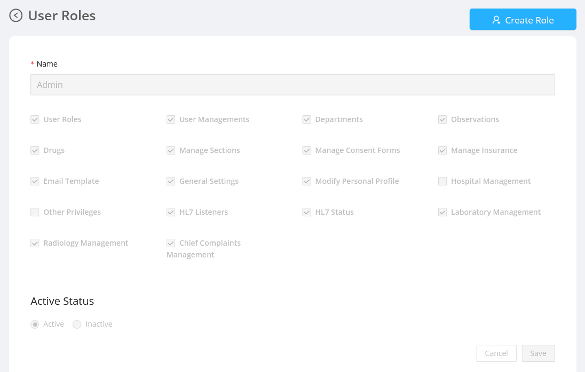
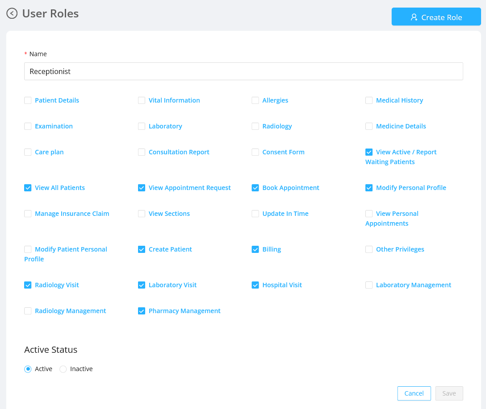

Displays the user privileges of the users which are necessary for accessing the functionalities provided by the application.

## Listing the Permissions and Status

- On selecting any user roles, the permissions associated with the respective user roles will be listed down.
- All the permisssions available for the selected user will be listed down which the admin can enable or disable.
- Admin can activate or deactivate the user role by selecting active or inactive option.
- All the changes will be reflected, only by clicking the `Save` button.

### Privilege definitions:

- `Laboratory` : Permission of user to manage the laboratory form(s)/section for the Doctor Order(s).
- `Laboratory Visit` : Permission of user to book a laboratory visit if given access.
- `Laboratory Management` : Permission of user to manage the laboratory department such as add/ update/ upload test report if given access.
- `Radiology` : Permission of user to manage the radiology form(s)/section for the Doctor Order(s).
- `Radiology Visit` : Permission of user to book a radiology visit if given access.
- `Radiology Management` : Permission of user to manage the radiology department such as add/ update/ upload test report if given access.
- `Pharmacy Management` : Permission of user to manage the pharmacy department if given access.

#### Admin User Privileges

#### Receptionist User Privileges

