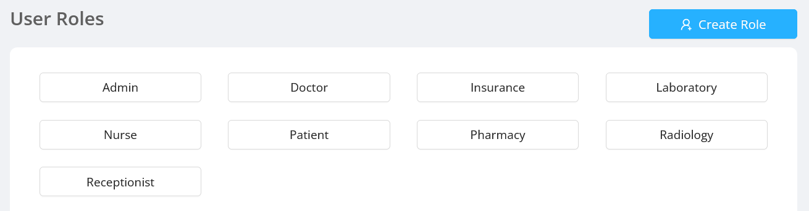
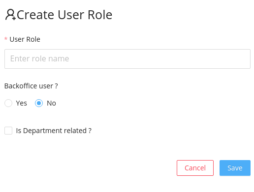

Displays the user roles in the application. Admin can create a new user role and edit the name, privileges, active status of existing user roles. 

## Listing the Roles

User roles section initially displays the list of user roles.

## Create New User Role

New user can be added by clicking the `Create Role` button.

Create User Role modal have basically three fields:

- `User role name` is a text field to enter the the name of the user role.
- `Backoffice User` determines whether the user can access the admin screen or not.
- `Is Department Related` is a checkbox to record whether the new user role is related to any department or not.

